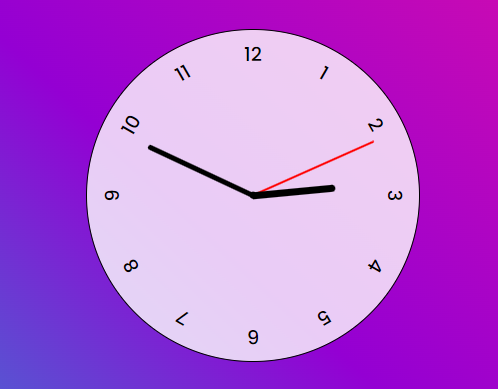

# Relógio analógico

> Um projeto que gosto muito e que me fez explorar mais do CSS e dos comandos currentDate do JavaScript. O resultado é esse relógio que mostra as horas, minutos e segundos em tempo real.

O site publicado pode ser acessado [aqui](https://marcellemarichal.github.io/clock/)
